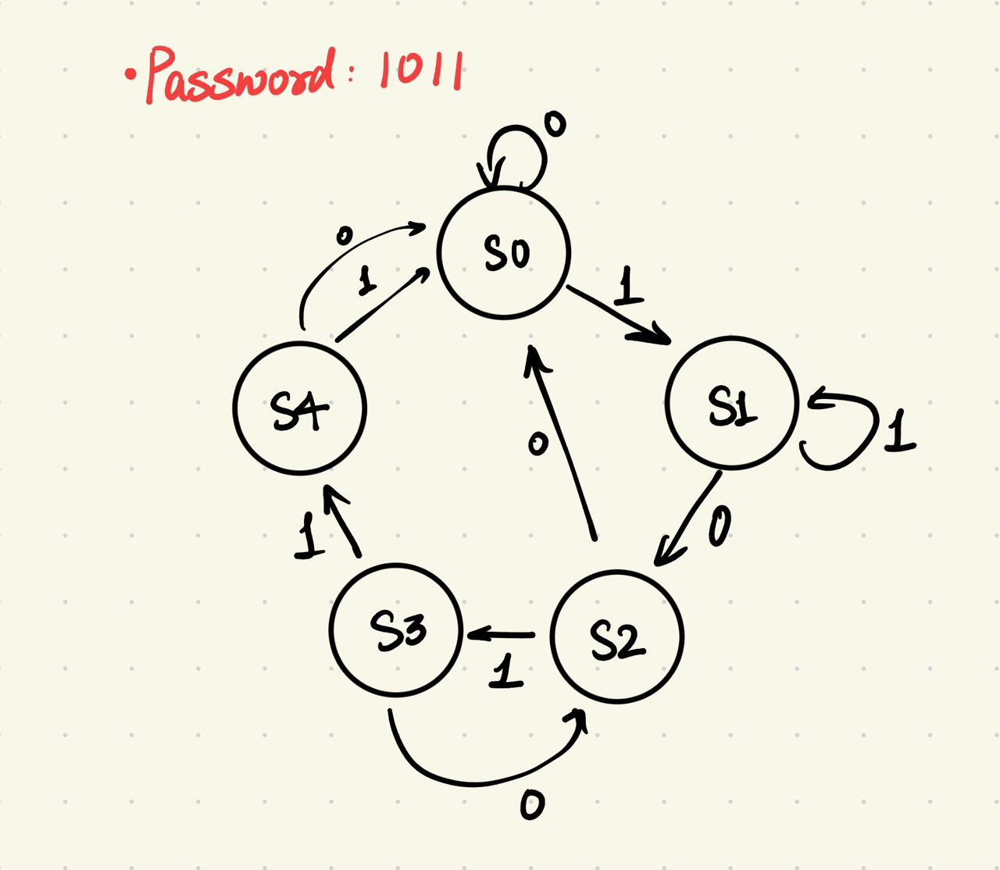
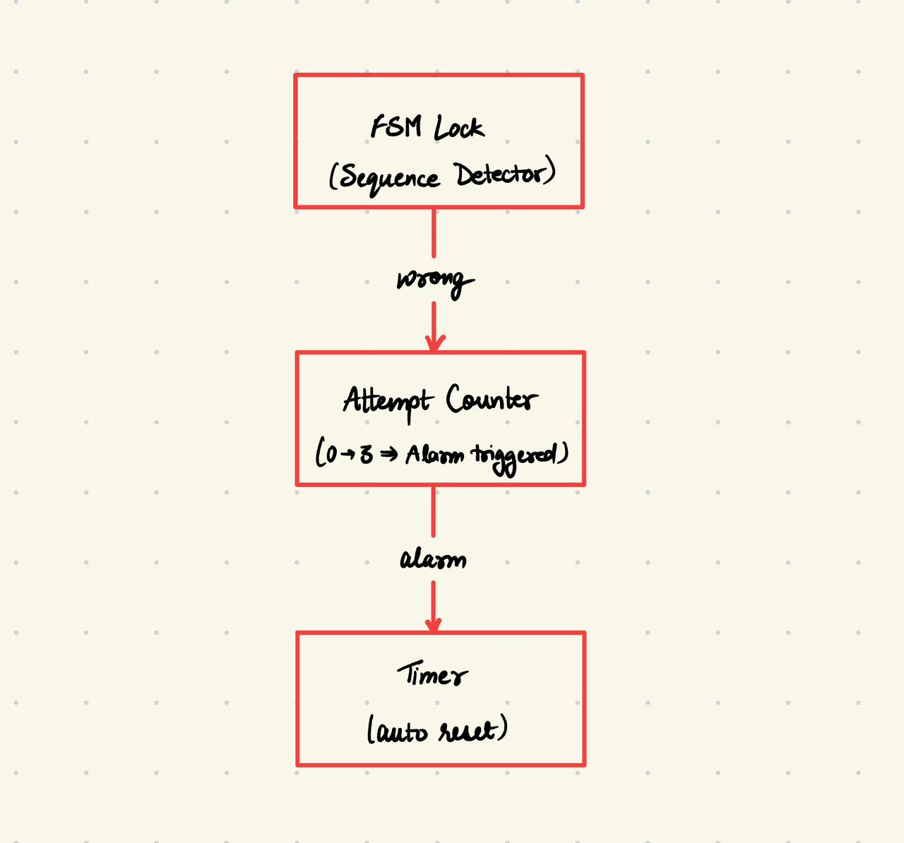
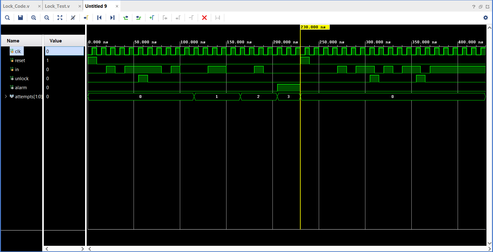

# Digital Door Lock System

A secure password-based digital door lock system implemented in Verilog HDL, designed using a Finite State Machine (FSM). The system detects a predefined binary password with a wrong attempt counter and alarm mechanism.

---

## Features

- Password detection (preset: 1011) using FSM  
- Unlock signal on correct sequence  
- Wrong attempt detection  
- Attempt counter (0 → 3)  
- Alarm triggered after 3 wrong attempts  
- Automatic reset after successful unlock  
- Overlapping sequence handling  
- Timeout-based reset mechanism  

---

## FSM States

| State | Description |
|------|------------|
| S0 | Initial state |
| S1 | Received `1` |
| S2 | Received `10` |
| S3 | Received `101` |
| S4 | Received `1011` → Unlock |

---

## FSM State Diagram

---

## Design Overview

The system consists of three main modules:

### 1. Finite State Machine (FSM)
- Detects the sequence `1011`
- Moore machine design
- Supports overlapping inputs

### 2. Attempt Counter
- Counts incorrect attempts
- Triggers alarm on 3rd wrong attempt
- Resets after correct password

### 3. Timer
- Resets system after inactivity

---

## Architecture

---

## Testbench Workflow

The testbench validates correct password detection, wrong attempt counting, alarm triggering after three failures, reset functionality, and overlapping sequence handling, ensuring correct system behavior.

Clock is generated with a 10 ns period. All state transitions occur on the positive edge of the clock.
Initialization: The system starts in reset state, FSM initializes to S0, attempts = 0, alarm = 0.

Correct password sequence (1011):
- #10 in = 1;
- #10 in = 0;
- #10 in = 1;
- #10 in = 1;
  FSM transitions S0 → S1 → S2 → S3 → S4 and unlock signal goes HIGH for one clock cycle, then resets to S0.

First wrong attempt:
- #10 in = 0;
- #10 in = 1;
- #10 in = 0;
  An incorrect sequence is applied, wrong signal is triggered, attempts becomes 1.

Second wrong attempt:
- #10 in = 1;
- #10 in = 1;
- #10 in = 0;
  Another incorrect sequence, attempts becomes 2.

Third wrong attempt:
- #10 in = 1;
- #10 in = 0;
- #10 in = 0;
  Third incorrect sequence, attempts becomes 3 and alarm is triggered.

FSM returns to S0, attempts reset to 0, alarm resets to 0.

Overlapping sequence test:
- #10 in = 1;
- #10 in = 0;
- #10 in = 1;
- #10 in = 1;
- #10 in = 0;
- #10 in = 1;
- #10 in = 0;
- #10 in = 1;
- #10 in = 1;
- #10 in = 0;
- #10 in = 1;
- #10 in = 1;
  This tests continuous input stream handling. The FSM successfully detects valid sequences even with overlapping inputs.

---

## Simulation

Waveform verifies:

- Correct password detection → unlock pulse  
- Wrong attempts → counter increment  
- Alarm after 3 wrong attempts  
- Reset functionality  
- Overlapping sequence detection  

---

## How to Run

1. Open project in Vivado  
2. Add all Verilog files  
3. Run Behavioral Simulation  
4. Observe signals:
   - unlock  
   - alarm  
   - attempts  

---

## Applications

- Digital door locks  
- Security systems  
- ATM PIN verification  
- Access control systems  

---

## Author

Anushree Verma

---
